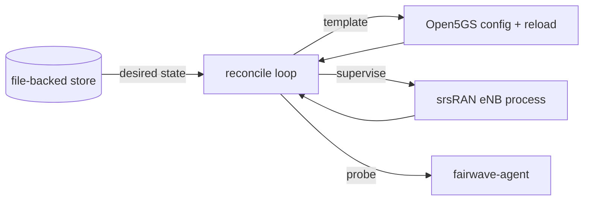
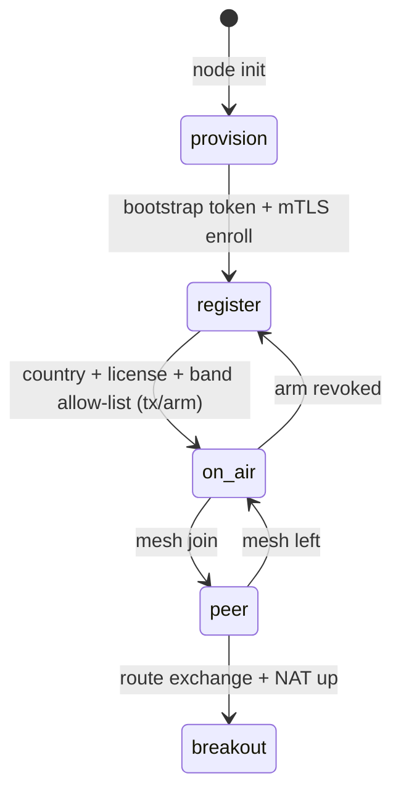

# Control Plane

`fairwave-control` is the brain of the box: it holds identity and keys, enrolls nodes, reconciles configuration into the core and RAN, and exposes the northbound REST API v1 used by the CLI and operator UI.

It is a Go service (`docs/adr/0003-control-plane-language.md`) with a file-backed store in v0.1. The control plane is the only component that writes to Open5GS and srsRAN configuration.

## Responsibilities

1. **Identity and keys** — node identity generation, mesh root CA issuance (mTLS), key separation from SIM credentials.
2. **Enrollment** — bootstrap-token-based onboarding of new boxes into a neighborhood.
3. **Reconcile loop** — desired state → concrete config for Open5GS (templating) and srsRAN (supervision), continuously.
4. **Northbound REST** — JSON API v1 for CLI, UI, and the agent.
5. **Southbound drivers** — Open5GS config templating + reload, srsRAN process supervision, agent health intake.
6. **Policy enforcement** — band allow-list, TX arm gate, APN policy.

## Reconcile Loop



The loop compares desired state (nodes, SIMs, policy, peers) against observed state (processes up, configs applied, heartbeat fresh) and converges. All mutations happen through the same code path, so the file store is the single source of truth.

## State Machine



Transitions are exposed as `POST /v1/lifecycle/transition`. Each transition re-validates prerequisites; a transition to `on-air` without an armed TX gate is refused.

## Northbound REST API (v1)

JSON under `/v1`:

| Endpoint | Purpose |
|---|---|
| `GET /v1/healthz` | liveness |
| `GET /v1/status` | node + subsystem status |
| `GET/POST /v1/nodes` | node records, enrollment |
| `GET/POST /v1/sims` | SIM issue/revoke (IMSI hashes only) |
| `GET /v1/peers` | mesh peer list |
| `GET /v1/sessions` | active bearer/session view |
| `GET/POST /v1/policy` | APN/band/breakout policy |
| `POST /v1/spectrum/check` | band legality pre-flight |
| `POST /v1/tx/arm` | TX gate (country, license ref, allow-list) |
| `POST /v1/lifecycle/transition` | state machine transitions |
| `GET /v1/version` | release string |
| `GET /metrics` | Prometheus exposition |

## Southbound Drivers

- **Open5GS driver:** renders per-node config from templates (PLMN/TAC/APNs, MME/SGW/PGW addressing), writes it into the Open5GS container, triggers graceful reload, verifies the services come back healthy.
- **srsRAN driver:** supervises the eNB container; restarts on crash with backoff, surfaces S1 status and UE attach counts back into `/v1/status`.

## Persistence

v0.1 uses a file-backed store under the data directory:

```
/var/lib/fairwave/
├── store/          # JSON records: nodes, sims, peers, policy, lifecycle
├── keys/           # node keys, mesh CA material (0600)
├── vault/          # SIM vault: Ki/OPc encrypted at rest
└── logs/
```

Ki/OPc are never written to the store in plaintext and never logged. IMSIs are stored as truncated sha256 hashes. Migration to a database is a post-M6 item (`design/roadmap.md`).

## Running

- Containerized by default in Docker Compose, or bare under systemd (`docs/software/fairwave-control.md`).
- Reads `FAIRWAVE_*` env vars and a YAML config file; see `docs/software/fairwave-control.md`.
