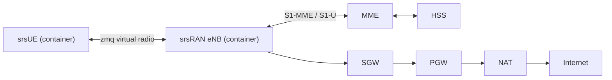

# Mobile Core (Open5GS)

Fairwave uses Open5GS as its LTE EPC (`docs/adr/0001-open5gs-vs-magma.md`). The core runs entirely on the box; there is no cloud dependency in v0.1.

## Services

| Service | Role | Default listen |
|---|---|---|
| MME | S1-MME termination, NAS/S1AP, attach/detach, bearer setup | S1-MME: 38412 |
| SGW | S1-U termination, user-plane switching | S1-U: 2152 |
| PGW | PDN anchoring, IP allocation, NAT hairpin source | GTP-C/GTP-U |
| HSS | SIM authentication vectors, subscription profiles | DIAMETER: 3868 |
| PCRF | Policy (APN-AMBR, QoS), used per-APN | Gx: 3868 |

Each service runs as its own container; `fairwave-control` owns their configuration and restarts.

## Identity and Subscription Defaults

| Item | Value |
|---|---|
| PLMN (lab) | `999-99` |
| TAC (lab) | `7` |
| APNs | `internet` (default data), `ims` (VoWiFi signaling) |
| SIM profiles | `lab` (test Ki/OPc, well-known), `prod` (operator-provided credentials) |
| IMSI | 15 digits, issued via `fairwave sim issue --count N --profile lab` |

SIM credentials (Ki/OPc) are generated in the SIM vault, injected into HSS, and never logged. See `docs/architecture/security.md`.

## Local Breakout

User traffic terminates locally by default (`docs/adr/0005-local-breakout-default.md`): PGW hands PDN traffic to an edge NAT, and the box's own uplink (Ethernet/Wi-Fi) carries it. No tunnel is required to reach the Internet.

Optional: the entire data plane is wrapped in WireGuard toward a hub/peer (`docs/adr/0004-wireguard-vs-ipsec.md`, `docs/architecture/peering.md`).

## Lab Topology (zmq)

No RF hardware is required: the `zmq` transport carries LTE-Uu over loopback. This is the default Compose stack in release `v0.1.0`.

## 5G SA/NSA

5G is **not implemented** in v0.1. Open5GS contains 5G core services (AMF/SMF/UPF/NRF/PCF), but Fairwave ships them disabled and untested. The M0–M6 roadmap (`design/roadmap.md`) scopes SA as a later milestone; NSA (dual connectivity with the eNB) is not planned. Docs do not imply 5G support.

## Related

- RAN side: `docs/architecture/ran.md`
- SIM lifecycle: `docs/software/fairwave-cli.md`
- Security of subscriber material: `docs/architecture/security.md`
