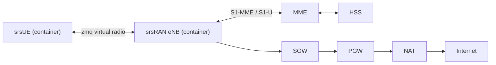

# Mobile Core (Open5GS + free5GC)

Fairwave uses Open5GS as its LTE EPC (`docs/adr/0001-open5gs-vs-magma.md`) and a free5GC 5G SA core as the 5G option (`core: free5gc`). The core runs entirely on the box; there is no cloud dependency in v0.1.

## Services

| Service | Role | Default listen |
|---|---|---|
| MME | S1-MME termination, NAS/S1AP, attach/detach, bearer setup | S1-MME: 38412 |
| SGW | S1-U termination, user-plane switching | S1-U: 2152 |
| PGW | PDN anchoring, IP allocation, NAT hairpin source | GTP-C/GTP-U |
| HSS | SIM authentication vectors, subscription profiles | DIAMETER: 3868 |
| PCRF | Policy (APN-AMBR, QoS), used per-APN | Gx: 3868 |

Each service runs as its own container; `fairwave-control` owns their configuration and restarts.

## Identity and Subscription Defaults

| Item | Value |
|---|---|
| PLMN (lab) | `999-99` |
| TAC (lab) | `7` |
| APNs | `internet` (default data), `ims` (VoWiFi signaling) |
| SIM profiles | `lab` (test Ki/OPc, well-known), `prod` (operator-provided credentials) |
| IMSI | 15 digits, issued via `fairwave sim issue --count N --profile lab` |

SIM credentials (Ki/OPc) are generated in the SIM vault, injected into HSS, and never logged. See `docs/architecture/security.md`.

## Local Breakout

User traffic terminates locally by default (`docs/adr/0005-local-breakout-default.md`): PGW hands PDN traffic to an edge NAT, and the box's own uplink (Ethernet/Wi-Fi) carries it. No tunnel is required to reach the Internet.

Optional: the entire data plane is wrapped in WireGuard toward a hub/peer (`docs/adr/0004-wireguard-vs-ipsec.md`, `docs/architecture/peering.md`).

## Lab Topology (zmq)

No RF hardware is required: the `zmq` transport carries LTE-Uu over loopback. This is the default Compose stack in release `v0.1.0`.

## 5G SA (free5GC)

Fairwave ships a **5G SA core** alongside the 4G EPC, switchable with `core: free5gc` in the control-plane config (`deploy/docker-compose.5g.yml`, configs under `core/free5gc/`). It runs free5GC's AMF, SMF, UPF, NRF, PCF, NSSF, AUSF, UDM, and UDR (Mongo), with the same lab PLMN `999-99` and `internet` APN.

- **Subscriber provisioning:** the HSS write-back driver (`hss.driver: free5gc`) upserts the UDR's seven document collections (authenticationSubscription, amData, smData, smfSelectionSubscriptionData, policyData.ues, identityData) exactly as free5GC's webconsole does.
- **Session visibility:** the collector polls the AMF's `namf-oam` API (`GET /namf-oam/v1/registered-ue-context`) and reports live 5G sessions to `/v1/sessions`.
- **Usage metering:** with `free5gc.cdr_dir` set, the collector reads the CHF's per-UE CDR files (TS 32.297 containers with BER `ChargingRecord` bodies) and feeds per-SIM byte totals into the same quota/auto-suspend pipeline as the 4G GTP-U tap - usage measured from the core, no packet capture required. See `core/free5gc/README.md`.
- **Radio:** srsRAN_Project gNB + srsUE 5G SA over ZMQ virtual radio (`core/ran/gnb.zmq.yml`, `core/ran/ue5g.zmq.yml`); UERANSIM is kept as an opt-in profile.

4G remains the default and best-tested path; NSA (LTE-anchored dual connectivity) is not planned.

## Related

- RAN side: `docs/architecture/ran.md`
- SIM lifecycle: `docs/software/fairwave-cli.md`
- Security of subscriber material: `docs/architecture/security.md`
