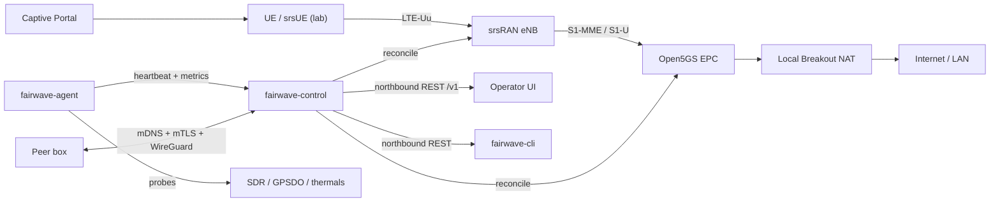
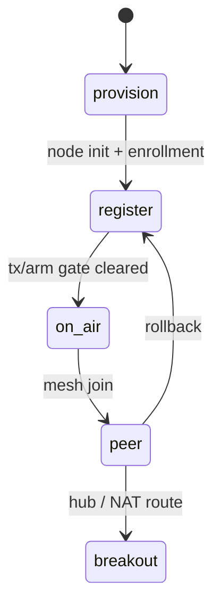

# Architecture Overview

Fairwave is an open-source community small-cell: a "carrier in a pizza box." An x86/ARM mini-PC drives a software-defined radio and runs the LTE core, RAN, control plane, and operator tooling as containers. One box is a private network. Several boxes, joined over a mesh, become a neighborhood network.

The default mode is **lab/no-RF**: srsRAN runs on the `zmq` virtual radio and srsUE replaces physical handsets, all inside Docker Compose. Real RF is disabled until a country code, license acknowledgment, and an allow-listed band are configured (the `tx/arm` gate).

## System Diagram

## Component Table

| Component | Role | Runs as |
|---|---|---|
| srsRAN eNB/gNB | LTE/NR radio: LTE-Uu or NR-Uu toward UEs, S1/N2 toward the core | container |
| srsRAN srsUE | Synthetic UE for lab tests (zmq loopback, 4G and 5G SA) | container |
| Open5GS EPC | MME, SGW, PGW, HSS, PCRF (4G, default) | containers (one per service) |
| free5GC core | AMF, SMF, UPF, NRF, PCF, NSSF, AUSF, UDM, UDR (5G SA, `core: free5gc`) | containers (one per service) |
| fairwave-control | Identity, enrollment, reconcile loop, REST API v1, usage metering | container / systemd |
| fairwave-agent | On-box health probes, heartbeat, watchdog | systemd |
| fairwave-cli | Operator commands against the REST API | binary |
| Operator UI | Local-first dashboard | container |
| Captive portal | Onboarding for non-cellular devices / Wi-Fi calling | container |

## Data Plane vs Control Plane

- **Data plane (4G):** UE ↔ eNB (LTE-Uu) ↔ S1-U ↔ SGW/PGW ↔ local breakout NAT ↔ Internet. **Data plane (5G SA):** UE ↔ gNB (NR-Uu) ↔ N3 ↔ UPF ↔ local breakout NAT ↔ Internet. User traffic never hairpins through a cloud.
- **Control plane:** NAS/S1AP signaling stays inside the box; `fairwave-control` reconciles configuration into Open5GS and srsRAN; policy (APN, breakout, band allow-list) lives in the control plane.
- **Management plane:** `fairwave-agent` → `fairwave-control` → CLI/UI, all on-box; peer boxes connect over an mTLS mesh with a WireGuard data plane.

## Lifecycle Phases

`provision → register → on-air → peer → breakout`. The transition API is `lifecycle/transition` under `/v1`; each phase is gated by prerequisite state (see `docs/architecture/control-plane.md`).

## Defaults

- PLMN `999-99` (lab), TAC `7`, APNs `internet` and `ims`.
- Local breakout (edge NAT) by default; WireGuard tunnel optional (`docs/adr/0005-local-breakout-default.md`).
- Core: Open5GS (4G) by default; free5GC 5G SA is an opt-in per-node switch (`core: free5gc`, `deploy/docker-compose.5g.yml`).
- Usage metering: GTP-U tap (4G) or free5GC CHF CDR files (5G) feed fair-use quotas with auto-suspend.
- Release `v0.1.0` targets lab mode; milestones M0–M6 in `design/roadmap.md`.

## Related

- Control plane: `docs/architecture/control-plane.md`
- Core network: `docs/architecture/mobile-core.md`
- Radio: `docs/architecture/ran.md`
- Security model: `docs/architecture/security.md`, `design/threat-model.md`
