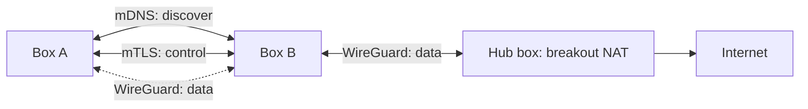

# Peering and Neighborhood Mesh

Several Fairwave boxes form a neighborhood network. Peering is opt-in and local-first: discovery and control use mDNS + mTLS, the data plane uses WireGuard, and routes are exchanged between peers.

## Discovery

- Boxes advertise a service record over **mDNS** (e.g. `_fairwave._tcp`) on the LAN.
- An operator explicitly invites a node with a bootstrap token; discovery only *finds* candidates, it never auto-joins.
- Bootstrap tokens are short-lived and single-use (TTL enforced; see `docs/architecture/security.md`).

## Trust: Local CA + mTLS

- Each neighborhood has a **mesh root CA** generated on the initiating box and kept in the control-plane key store.
- Peer certificates are issued with constrained usage (client/server auth for control-plane endpoints only).
- All control-plane inter-box traffic is mTLS; keys are 0600 on disk.

## Data Plane: WireGuard

- WireGuard tunnels carry subscriber data between peers and to a hub.
- Local breakout stays the default per-box; a tunnel is only established when policy requires (e.g. a cafe with no own uplink).
- Chosen over IPsec in `docs/adr/0004-wireguard-vs-ipsec.md`.

## Route Exchange

- Peers exchange simple prefix routes (PDN pools, home-network prefixes) over the mTLS channel.
- Route policies are per-peer: a box can advertise, accept, or refuse transit.
- Loop prevention is explicit (no transitive announcements in v0.1); this is deliberately simpler than full BGP.

## Hub Breakout

One box may act as hub: it holds the uplink (and possibly a certified small-cell path) and terminates other boxes' WireGuard tunnels. Hub selection is operator-chosen, not auto-elected, in v0.1.

## Roaming (Future — Honest Scope)

True roaming across operators (SEPP, IPX, GPRS Tunneling via inter-PLMN) is **not implemented**. M-series items only (`design/roadmap.md`). What exists today: hand-rolled inter-box mobility for the same neighborhood over the mesh. Documenting "roaming" beyond that would be inaccurate.

## Related

- Security: `docs/architecture/security.md`, `design/threat-model.md`
- WireGuard decision: `docs/adr/0004-wireguard-vs-ipsec.md`
- Lifecycle: `docs/architecture/control-plane.md`
