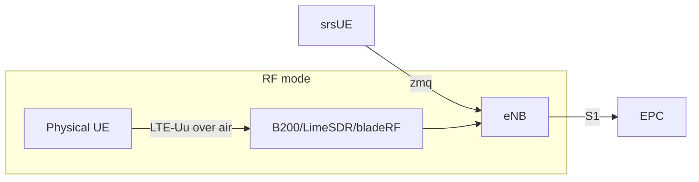

# Radio Access Network (RAN)

The RAN is srsRAN Project's eNB, driving a software-defined radio. The same software stack runs in two modes: **zmq virtual radio** (lab, no RF) and **real RF** (gated).

## srsRAN Project eNB

- LTE eNB implementing LTE-Uu (PHY/MAC/RLC/PDCP/RRC) and S1-MME/S1-U toward Open5GS.
- Single-box deployment: one eNB per Fairwave node, one cell per box in v0.1.
- Supervised by `fairwave-control` (restart with backoff, status surfaced to `/v1/status`).

## Radio Frontend

| Frontend | Transport | Mode |
|---|---|---|
| `zmq` | virtual radio over loopback (ZMQ PUB/SUB) | lab, default, RF disabled |
| UHD | USRP B200 / B200mini / B210 via USB 3.0 | RF, gated |
| LimeSuite | LimeSDR / LimeSDR Mini via USB 3.0 | RF, gated |
| bladeRF | bladeRF x40/x115 via USB 3.0 | RF, gated |

**Real RF is disabled by default.** The `tx/arm` gate requires, at minimum, a configured country code, a license acknowledgment, and a band allow-list entry (`POST /v1/tx/arm`). Nothing transmits before the gate is cleared.

## Frequency Configuration

- **EARFCN**: channel raster index per band, e.g. Band 3 (1800 MHz) DL EARFCN 1200, Band 7 (2600 MHz) DL EARFCN 2750, Band 41/48 territory depending on region.
- Band and EARFCN must be present in the allow-list configured by the operator; the gate refuses anything outside it.
- `POST /v1/spectrum/check` validates band/EARFCN/bandwidth combos and the configured region profile before the gate will arm.

## Synchronization

Cellular timing budget: LTE requires eNB reference sync on the order of microseconds for decent neighbor/measurement behavior; strict TDD (e.g. Band 41) requires air-interface alignment.

| Source | Accuracy | Use |
|---|---|---|
| NTP | ms-class | lab mode only, acceptable for zmq |
| PTP (1588) | sub-µs over LAN | best-effort RF |
| GPSDO (e.g. Tallysman/OctoClock U.FL input to B200) | <50 ns disciplined | recommended for real RF |

`fairwave-agent` reports GPSDO lock and NTP offset as health signals; the operator UI surfaces them as backhaul/sync health.

## Power and RF Hygiene

- EIRP is capped by policy; the cap must be set per band profile and is enforced by the `tx/arm` gate configuration, not by the SDR hardware alone.
- Bench testing with real RF requires an attenuator between SDR TX and any receiver; a 30–40 dB attenuator is the documented minimum (`docs/hardware/sdr-notes.md`).
- Full duty-cycle LTE can be thermally demanding: see `docs/hardware/enclosure.md` for cooling constraints.

## Lab Topology

## Related

- Frontend comparison: `docs/hardware/sdr-notes.md`
- Band/region law: `docs/spectrum-and-law/index.md`
- TX gate and state machine: `docs/architecture/control-plane.md`
