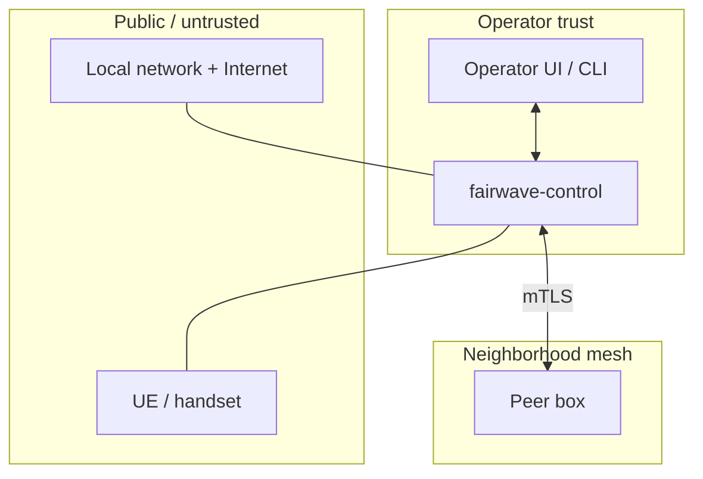

# Security Architecture

Fairwave treats "the box" as hostile-adjacent: it sits in a cafe, not a datacenter. The design is documented in `design/threat-model.md`; this page is the readable summary.

## Trust Boundaries

- The operator (local console / UI / CLI) is the trust root.
- Peers are semi-trusted: control via mTLS, data via WireGuard, routes by policy.
- UEs are untrusted; they see only the EPC and the captive portal.

## Key Separation

Two independent stores, deliberately separate:

| Store | Contents | Purpose |
|---|---|---|
| Mesh root CA | CA key, peer certificates | mTLS between boxes |
| SIM vault | Ki/OPc, IMSI → credential records | HSS injection |

Compromise of the mesh CA does **not** expose SIM credentials, and vice versa. Ki/OPc are encrypted at rest in the vault and never written to logs or the file store.

## Authentication

| Surface | Mechanism |
|---|---|
| Node enrollment | Bootstrap token, single-use, short TTL (default 10 min) |
| Operator UI / CLI | Local-first: WebAuthn (passkey/FIDO2) + TOTP; local accounts only in v0.1 |
| Inter-box control | mTLS, leaf certs signed by the mesh CA, constrained EKUs |
| Agent → control | Shared node key + mTLS, heartbeat signed |

## Secrets Handling

- Keys at rest: 0600, root-owned, under `/var/lib/fairwave/keys/`.
- SIM vault: encrypted (age/libsodium or platform KMS where available); unlock happens at boot via a local secret, not a network secret.
- `FAIRWAVE_*` env vars for non-secret config only; secrets go through files, not environment.
- Secrets are never printed by the CLI or agent; `doctor` redacts them.

## IMSI Privacy

- IMSIs are stored **at rest as truncated sha256 hashes** (e.g. first 8 bytes hex), not raw — except inside the SIM vault, which needs the raw value to program HSS.
- Logs, metrics, and the UI show only hashes or derived IDs. Metrics and logs never emit full IMSI.
- Rationale: a neighborhood box is a low-trust device; raw IMSIs should not be recoverable from a stolen disk, UI screenshot, or log dump.

## What Is Not Secured (Honest)

- No hardware security module; a root attacker on the box gets the keys.
- No remote attestation; theft of a box requires manual key revocation (`sim revoke`, peer drop, mesh CA roll).
- v0.1 has no built-in OS-level firewall policy; operators should run the box on a segregated VLAN and enable the OS firewall.

## Related

- Threat model: `design/threat-model.md`
- Peer trust: `docs/architecture/peering.md`
- Incident response: `docs/ops/incident-response.md`
