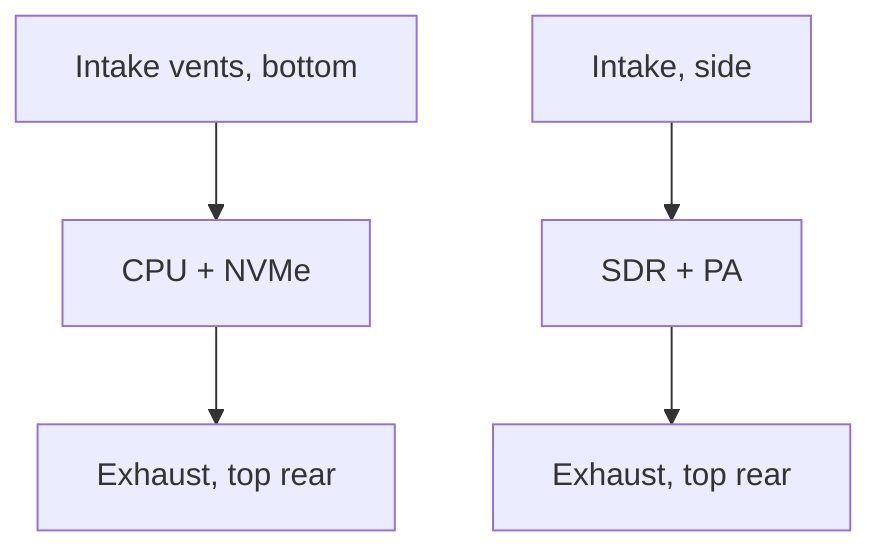

# Enclosure (Pizza Box)

The reference enclosure is a **260 mm pizza-box** case: a shallow, wide chassis that holds a mini-PC or SBC plus an SDR, with RF and network on SMA/ethernet bulkheads. It looks unremarkable on a shelf, which is the point for community deployments.

## Specification

| Item | Value |
|---|---|
| Form factor | ~260 × 260 × 45 mm (W×D×H), 1.5–2 U shelf style |
| Material | aluminum or steel; aluminum preferred for thermal coupling |
| Compute bay | mini-PC or CM4 + carrier (any tier) |
| RF bay | SDR on standoffs over vented section |
| RF bulkhead | 2× SMA (TX/RX), short low-loss leads to SDR ports |
| I/O | Ethernet passthrough (or PoE input), USB service port, power inlet |
| Weight | ~1.5–2.5 kg populated |

## Passive Cooling

- Design target: < 35 °C intake, ≤ 25 °C ΔT over ambient at 25 W sustained.
- Vented top/bottom with chimney effect; SDR over its own vent path (SDRs dissipate RF PA heat).
- **No fan by default.** If the PA or CPU exceeds thermal budget (agent reports `cpu_temp_celsius`), the case gets a low-noise fan kit - this is a documented upgrade, not a v0.1 failure.

## Airflow and Placement Rules

- ≥ 50 mm clearance on top and bottom; never in a closed cabinet.
- Inlet must not face a heater or another box's exhaust.
- RF SMA leads routed away from switching PSU area; keep them short (< 20 cm).

## Grounding

- Chassis grounded to the same PE as the uplink switch/router; a single-point ground star to the PSU negative.
- SMA shields bond to chassis ground via the bulkhead (common-mode currents then leave via PE, not the radio).
- If PoE is used, the injector/midspan must be grounded to the same PE as the switch.

## Power

- 12 V DC inlet (or PoE 802.3at injector for PoE-capable builds), 30–60 W budget.
- PoE injector goes outside the case; the case carries only the split DC or the ethernet passthrough.

## Photos

Placeholder: photos of the assembled v0.1 enclosure (top, vent side, SMA bulkhead, populated interior) will be linked here when hardware photos land. Until then, the layout diagram above is the source of truth.

## Related

- Tiers and BOMs: `docs/hardware/bom-tiers.md`
- SDR mounting notes: `docs/hardware/sdr-notes.md`
- Thermal telemetry: `docs/architecture/telemetry.md`
