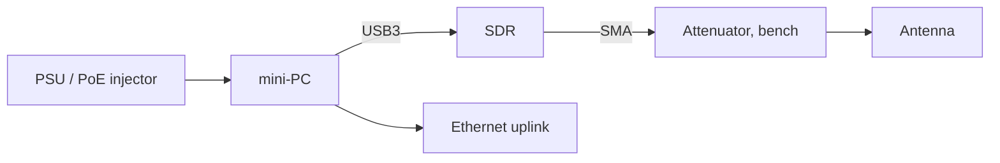

# Hardware

Fairwave runs on commodity x86/ARM hardware: a mini-PC (the "pizza box") plus a USB SDR. Three reference tiers exist, from a desk lab to a US-certified small cell. BOMs: `docs/hardware/bom-tiers.md`.

## Tier Overview

| Tier | Purpose | Platform | RF | Gate |
|---|---|---|---|---|
| Dev | software + core dev, CI, demos | any x86/ARM mini-PC | none (zmq) or any SDR | lab-only |
| Community | private network at home/office/cafe | NUC / CM4 + HAT | LimeSDR / B200 class | tx/arm + region profile |
| CBRS (US) | licensed shared access small cell | NUC/mini-PC + certified radio | certified small-cell path | SAS + certification |

Dev tier does not need an SDR at all: srsRAN zmq + srsUE run in Compose on the mini-PC alone.

## Common Constraints

- **Power:** full-duplex SDR + SBC/mini-PC draws 15–60 W. USB 3.0-powered SDRs can brown out with long cables; use short quality cables or a powered hub. PoE (802.3at/af) only where the box is PoE-capable (`docs/hardware/enclosure.md`).
- **Cooling:** passive-only enclosures need thermal budget headroom; a LimeSDR in full TX duty plus an NUC-class PC can exceed a passive case's budget (`docs/hardware/enclosure.md`).
- **GPSDO:** recommended for real RF sync. B200 family takes the OctoClock/Microphase reference input; some boards expose PPS + 10 MHz to the radio.
- **USB:** SDRs want dedicated USB 3.0 controllers; a shared hub with a disk is a recipe for overruns (choppy uplink, bursty `underrun` logs).
- **Ethernet:** the box needs one stable uplink (WAN or LAN); the data plane crosses it.

## Reference Builds

| Build | Cost (approx) | Link |
|---|---|---|
| Dev: mini-PC only, zmq | ~$200 | `bom-tiers.md` |
| Community: NUC/CM4 + LimeSDR Mini | ~$450–850 | `bom-tiers.md` |
| Community premium: + B200mini | ~$1,250 | `bom-tiers.md` |
| CBRS US: certified path | ~$2,000+ | `bom-tiers.md`, `cbrs.md` |

## RF Antenna and Hygiene

- SMA bulkhead pass-throughs on the enclosure; keep RF lines away from switching PSUs and USB3 hubs.
- Bench testing with any TX-capable SDR: **30–40 dB attenuator in the TX path** (`docs/hardware/sdr-notes.md`).
- External antennas are user-provided; the box does not ship one.

## Layout

## Related

- BOMs: `docs/hardware/bom-tiers.md`
- Enclosure and thermal: `docs/hardware/enclosure.md`
- SDR notes: `docs/hardware/sdr-notes.md`
- Golden image: `docs/hardware/image.md`
- Spectrum/law: `docs/spectrum-and-law/index.md`
