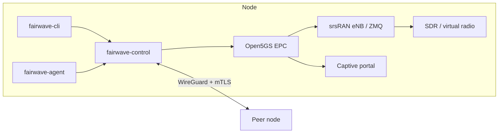

# Fairwave Documentation

> Fairwave defaults to lab/no-RF mode. Transmitting on cellular bands without proper authorization is illegal in most jurisdictions. You are solely responsible for licenses, SAS grants, indoor restrictions, and type approval. HyperonX and contributors provide software as-is for lawful private networks, research, and shared-spectrum regimes only.

## What is Fairwave?

Fairwave is an open-source community small-cell: a self-contained private 4G/5G network built from commodity hardware and open-source software. A Fairwave node is an x86 or ARM mini-PC paired with an SDR (USRP, LimeSDR, or BladeRF) running:

- **Open5GS** as the 4G EPC (MME, SGW, PGW, HSS) - the default core.
- **free5GC** as the optional 5G SA core (AMF, SMF, UPF, NRF, PCF, NSSF, AUSF, UDM, UDR; `core: free5gc`).
- **srsRAN Project** as the eNB/gNB (and srsUE as a test handset, 4G and 5G SA over ZMQ).
- **fairwave-control** (Go) as the control plane that glues the node together - including fair-use metering with per-UE quotas and auto-suspend, measured from the core (GTP-U tap in 4G, free5GC CHF CDRs in 5G).
- **fairwave-agent** (Go) on each node, and **fairwave-cli** (Go) for operators.
- An operator UI and a captive portal for subscriber onboarding.

Fairwave targets lawful private networks, research, education, and shared-spectrum regimes (CBRS GAA, ISM-adjacent experimentation under local rules). It ships **RF-disabled by default**: the default stack is a fully virtual lab using srsRAN's ZMQ virtual radio with zero emissions.

## Project facts

- **Release:** v0.1.0 (lab) - no-RF virtual radio only.
- **Defaults:** PLMN `999-99`, TAC `7`, APNs `internet` and `ims`.
- **Cores:** Open5GS EPC (4G, default) and free5GC 5G SA (opt-in via `core: free5gc`; `deploy/docker-compose.5g.yml`).
- **Fair use:** per-UE byte counters from the core - GTP-U tap (4G) or free5GC CHF CDR files (5G) - feeding quotas with auto-suspend (`fairwave sim quota` / `usage`).
- **Lab mode:** srsRAN eNB/gNB and srsUE over ZMQ virtual radio inside Docker; no SDR touched.
- **TX gate:** real RF requires the `tx_arm` gate: country code + license acknowledgment + frequency allow-list, all three set.
- **Lifecycle:** provision → register → on-air → peer → breakout, with local breakout (edge NAT) as default and WireGuard mesh peering as an option.
- **SIMs:** offline-first provisioner, IMSI-based (15 digits), lab and prod profiles kept separate; Ki/OPc never committed or logged.
- **Milestones:** M0 (bootstrap) through M6 (production hardening); see `/design/roadmap.md`.

## Documentation map

| Area | Path |
| --- | --- |
| Get running in 30 minutes, no RF | [Tutorials: quickstart no-RF](tutorials/quickstart-no-rf.md) |
| Lab deep dive | [Tutorials: lab attach](tutorials/lab-attach.md) |
| Multi-node meshes | [Tutorials: two-box peering](tutorials/two-box-peering.md) · [Peering overview](peering/index.md) |
| Subscriber credentials | [SIM lifecycle](sim-lifecycle/index.md) · [Provisioner](sim-lifecycle/provisioner.md) · [Bureau runbook](sim-lifecycle/bureau-runbook.md) · [Revocation](sim-lifecycle/revocation.md) · [eSIM](sim-lifecycle/esim.md) |
| Operator security | [Security overview](security/index.md) · [Operator auth](security/operator-auth.md) · [Privacy](security/privacy.md) · [Release signing](security/release-signing.md) |
| APIs | [API overview](api/index.md) · [REST reference](api/rest.md) · [gRPC note](api/grpc.md) · `api/openapi.yaml` |
| Reference | [Glossary](reference/glossary.md) · [Troubleshooting](reference/troubleshooting.md) · [Regulator FAQ](reference/faq-regulators.md) · [Carrier FAQ](reference/faq-carriers.md) · [What Fairwave is NOT](reference/not-fairwave.md) |
| Decisions | [ADR index](adr/0002-4g-first.md) and siblings - ADR-0001, 0003–0012 |
| Design documents | `/design/threat-model.md`, `/design/spectrum-matrix.md`, `/design/roadmap.md` (mirrored in nav) |

## Where to start

Follow the [30-minute no-RF quickstart](tutorials/quickstart-no-rf.md). It boots a complete EPC with a virtual eNB and UE on your laptop and ends with a live attach and a clean teardown.

If you plan to touch anything that could emit RF, read the [spectrum gate ADR](adr/0008-spectrum-gate.md), the [spectrum matrix](/design/spectrum-matrix.md), and the regulatory FAQ first - and remember the banner at the top of this page.
