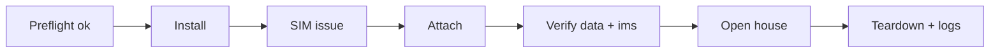

# Cafe Pilot

> Fairwave defaults to lab/no-RF mode. Transmitting on cellular bands without proper authorization is illegal in most jurisdictions. You are solely responsible for licenses, SAS grants, indoor restrictions, and type approval. HyperonX and contributors provide software as-is for lawful private networks, research, and shared-spectrum regimes only.

A **cafe pilot** is a two-hour, single-site demonstration: a box, a few SIMs, one or two handsets, free Wi-Fi + VoWiFi via the captive portal. It exists to prove the stack, not to be a service.

## What a Pilot IS and ISN'T

| A pilot is… | A pilot is NOT… |
|---|---|
| Lab-mode demonstration (zmq) with simulated UEs | A public mobile service |
| RF demo **only** with a valid authorization in hand | A way to test "if anyone notices" |
| Guest Wi-Fi + portal onboarding | Free cellular coverage for strangers |
| Proof of the operator tooling | A revenue or pilot-toll operation |

Without a license/grant/registration covering the site, **the only lawful pilot is lab mode** — no RF at all.

## Timeline (2 hours)

| Time | Phase | Steps |
|---|---|---|
| 0:00–0:15 | Preflight | checklist, box boot, `fairwave doctor`, SDR probe (if authorized RF) or zmq |
| 0:15–0:30 | Install | golden image up, compose stack up, control plane healthy |
| 0:30–0:40 | SIM issue | `fairwave sim issue --count 3 --profile lab` |
| 0:40–0:55 | UE attach | srsUE attach (lab) or authorized handset attach (RF), verify sessions |
| 0:55–1:10 | Verify | data plane via `internet` APN, VoWiFi path via `ims`, UI checks |
| 1:10–1:40 | Open house | guests use Wi-Fi/portal; operator watches counts, not identities |
| 1:40–1:50 | Teardown | drop sessions, stop stack, gate logs exported |
| 1:50–2:00 | Post-mortem | notes into `docs/ops/` or issue tracker |

## Preflight Checklist (abridged — full: `docs/spectrum-and-law/compliance-checklist.md`)

- [ ] Authorization status decided: **lab** (default) or **authorized RF** (documented).
- [ ] RF pilot: country, license ref, band allow-list, EIRP cap set; attenuator in TX path for bench.
- [ ] Lab pilot: `tx/arm` stays off; banner shows LAB MODE.
- [ ] Backup snapshot taken (`docs/ops/backup-restore.md`).
- [ ] Incident runbook within reach (`docs/ops/incident-response.md`).

## Verify Gates

## Teardown

1. `fairwave-cli` revoke any demo SIMs or leave them, per pilot policy.
2. Stop the stack; export `journalctl` slices + gate log as evidence artifacts.
3. Restore box to golden image state (or lab state) for the next pilot.

## Sign-off

Pilot record (operator, date, site, mode lab/RF, authorization ref if RF) gets filed with the checklist. If a pilot turns into a repeated service, it stops being a pilot: the authorization and ops posture must change first.
