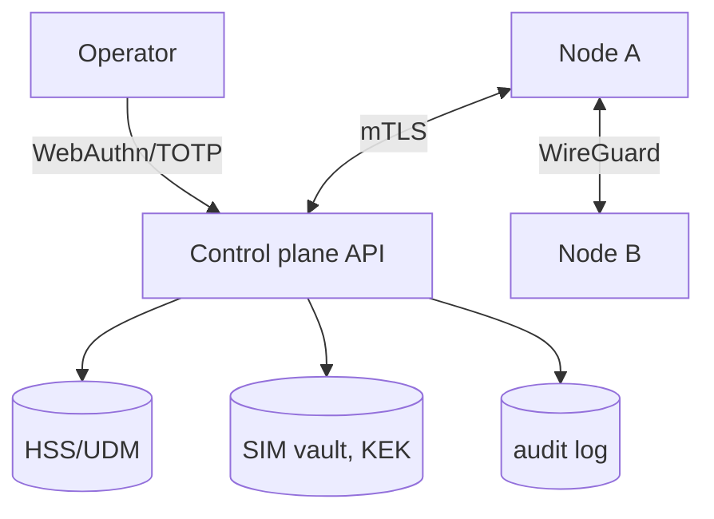

# Security Overview

Fairwave's security posture is: **private by default, RF off by default, credentials local by default.** This page is the index; the linked pages carry the specifics.

## Threat model

The authoritative document is `/design/threat-model.md`. In short:

- **In scope:** local attackers on the node OS, network attackers on the transit path, credential leaks from operator workstations, malicious or compromised peer operators, physical access to nodes/SDRs.
- **Out of scope:** nation-state signals intelligence against 4G/5G air interface crypto (we inherit 3GPP crypto as-is); supply-chain compromise of third-party images beyond our SBOM and signing (see [release signing](release-signing.md)).

## Key separation

| Key | Where it lives | Never |
| --- | --- | --- |
| SIM Ki/OPc | AES-256-GCM vault, cluster KEK (env/HSM) | plaintext files, logs, git (ADR-0006) |
| Cluster KEK | env or HSM slot | any file written by the provisioner |
| Mesh CA + node certs | node key store (0600), pinning at join | export outside the node |
| WireGuard keys | node key store, rotated | config files |
| Operator credentials | WebAuthn passkeys/TOTP, no passwords at rest | shared or logged (ADR-0007) |
| Discovery keys (mDNS/rendezvous) | node store; signatures required | unsigned announces accepted |

## Authentication and authorization

- **Operators → control plane:** WebAuthn passkeys (primary) + TOTP (fallback), bootstrap tokens only at first enrollment with TTL (ADR-0007). RBAC roles: `viewer`, `operator`, `sim:admin`, `auditor` per [operator auth](operator-auth.md).
- **Node ↔ node:** mTLS, mesh CA chain, certificate pinning at join (see [peering](index.md)).
- **API clients:** mTLS or token with role claims; see [API overview](../api/index.md).

## Logging and privacy

- IMSI, Ki, OPc are never logged in cleartext; identifiers are SHA-256 truncated to 12 hex (ADR-0010). Dashboards show hashes only. Details in [privacy](privacy.md).

## Supply chain

- Release binaries and containers are signed with cosign keyless signing; SBOMs (syft, SPDX) are published per release; verification commands are in [release signing](release-signing.md).

## Responsible disclosure

- Security issues: see `SECURITY.md` at the repo root — report via email (security@fairwave.example.org, PGP-published), do not open public issues for vulnerabilities. SLO: acknowledgment within 72 h, coordinated disclosure after 90 days or per reporter preference.
- We publish fixes in the next release and backport to the latest minor on request.

## Architecture at a glance

## Pages in this section

- [Operator auth](operator-auth.md) — tokens, passkeys, TOTP, RBAC, sessions, audit.
- [Privacy](privacy.md) — what we log (and what we refuse to).
- [Release signing](release-signing.md) — cosign, SBOM, verification.
- Related: [SIM lifecycle](../sim-lifecycle/index.md), [peering](../peering/index.md), ADR-0006/0007/0010.
