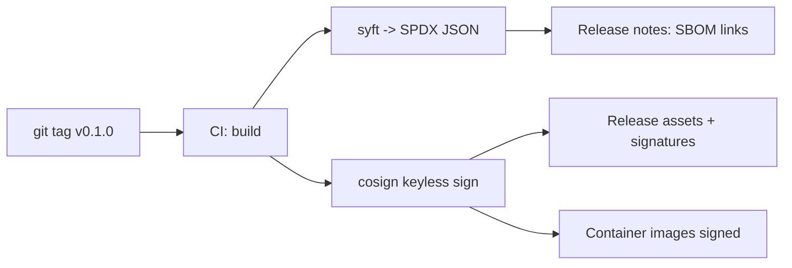

# Release Signing and SBOM

Every Fairwave release is signed and ships a machine-readable bill of materials. This page documents the tools, the CI flow, and how to verify.

## Tools

| Purpose | Tool | Artifact |
| --- | --- | --- |
| Artifact signing | cosign (keyless) | `.sig` signature files, container signatures |
| SBOM generation | syft | SPDX JSON per artifact |
| Container signing | cosign | Registry signature (`ghcr.io/hyperonx/fairwave-*`) |
| CLI + agent signing | cosign | Signature + bundle per release asset |

## Keyless signing

Fairwave uses **cosign keyless signing** (Fulcio/Sigstore): there is no long-lived signing key to steal.

- The CI workflow gets an ephemeral identity from GitHub OIDC (`iss=https://token.actions.githubusercontent.com`, subject = repo + workflow + ref).
- Fulcio certifies that identity; the certificate chain itself becomes the trust root record.
- Verification binds to the repository identity: `github.com/hyperonx/fairwave` and the release tag.

## CI flow



Per release: binary, `.sig` (signature), `.bundle` (Sigstore bundle with Fulcio cert), `sbom.spdx.json` (syft, SPDX format), and a signed manifest listing all artifact digests.

## Verification commands

```bash
# CLI binary
cosign verify-blob \
  --certificate-identity "https://github.com/hyperonx/fairwave/.github/workflows/release.yml@refs/tags/v0.1.0" \
  --certificate-oidc-issuer "https://token.actions.githubusercontent.com" \
  --signature fairwave-cli-linux-amd64.sig \
  fairwave-cli-linux-amd64

# Container image
cosign verify ghcr.io/hyperonx/fairwave-control:0.1.0

# SBOM integrity (cosign-sign the SPDX too, then diff against artifact digests)
cosign verify-blob --signature sbom.spdx.json.sig sbom.spdx.json
syft verify sbom.spdx.json --digest sha256:...
```

Expected verification output ends with:

```
Verified OK
```

## Trust root

- The trust root is **GitHub's OIDC issuer + the hyperonx/fairwave repository identity** - not a Fairwave-controlled key.
- Adversaries would need to compromise the GitHub repo workflow or Sigstore's root infrastructure to forge a signature; both are outside Fairwave's control and monitored publicly.
- For air-gapped or paranoid deployments, `cosign verify-blob` supports offline verification against a pinned Fulcio root (documented in `/design/roadmap.md` M6).

## SBOM scope

- syft generates SPDX JSON for every container image and the statically linked CLI/agent binaries (Go modules + base image packages).
- We publish the SBOM as a release asset and embed the SPDX JSON in the image (`/sbom.spdx.json`).
- The SBOM is regenerated per release; nightly scans (trivy/grype) run in CI and are reported in release notes.

## What this does NOT give you

- No guarantee the upstream projects (Open5GS, srsRAN, Go stdlib) are vulnerability-free - the SBOM is the *map*, not the *patrol*.
- No cryptographic attestation of reproducibility (that is M6 scope).

## Related

- [Security overview](index.md) · SECURITY.md (root) · `/design/roadmap.md`
