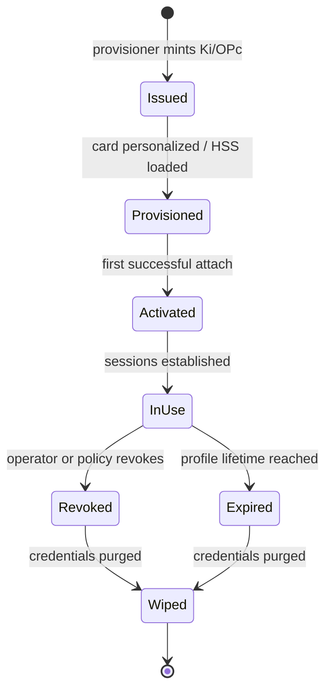

# SIM Lifecycle

Subscriber credentials are the most sensitive material Fairwave touches. This section documents the states a SIM moves through, who is allowed to do what, and the security boundaries around the credential store.

## State machine



| State | Meaning | Who transitions it |
| --- | --- | --- |
| Issued | Ki/OPc generated, not yet loaded anywhere | provisioner (`sim issue`) |
| Provisioned | Loaded into HSS/UDM and/or card personalized | provisioner hook, bureau |
| Activated | First successful authentication against the EPC | control plane on attach |
| In-use | Active sessions; normal operation | control plane |
| Revoked | Auth rejected at the HSS/UDM; sessions torn down | operator (`sim revoke`), policy |
| Expired | Profile lifetime (e.g. 12 months) elapsed | control plane timer |
| Wiped | Ki/OPc removed from stores and backups | operator, retention job |

Transitions are recorded in the audit log with the acting principal; see [revocation](revocation.md) and [operator auth](../security/operator-auth.md).

## Roles

| Role | Typical actor | Allowed on SIMs |
| --- | --- | --- |
| `sim:issuer` | Provisioner operator | Issue, expire |
| `sim:operator` | Day-to-day operator | Activate, revoke, view metadata |
| `sim:auditor` | Compliance | Read audit log, hashes only |
| `sim:admin` | Root operator | Everything incl. wipe, key rotation |

Roles map to RBAC in the control plane; all SIM actions require mTLS-authenticated principals (see [operator auth](../security/operator-auth.md)).

## Security boundaries

- **Ki/OPc at rest:** AES-256-GCM encrypted with a per-cluster KEK derived from env/HSM; never plaintext on disk (ADR-0006).
- **At rest hashes:** SHA-256 of IMSI/Ki/OPc truncated to 12 hex characters are the only forms that appear in logs, metrics, or dashboards (ADR-0010).
- **In motion:** provisioner output is written offline; encrypted bundles are the only transport artifact (bureau runbook).
- **Separation:** lab SIMs and prod SIMs use distinct profiles, distinct IMSI ranges (prefixes), and distinct stores. The control plane refuses to mix them in one operation.
- **No network, no plaintext:** the provisioner never phones home and never emits Ki in CSV/JSON outputs by default.

```mermaid
flowchart LR
    subgraph Secure enclave
        KEK[Cluster KEK (env/HSM)]
        Vault[Encrypted SIM vault]
        Prov[Provisioner]
    end
    Prov -->|issue| Vault
    Prov -->|offline CSV/JSON + hashes| Out[Output dir]
    Prov -->|HSS hook| HSS[(HSS/UDM)]
    Vault -->|decrypt, one-time| HSS
```

## Legal note on credential ownership

The Ki/OPc of a SIM are the credentials that authenticate a subscriber to your network. Whoever holds them can impersonate the subscriber in your network. Treat them as secrets:

- Never commit `sims/` output or bundles to git.
- Rotate cluster KEKs on personnel change.
- Document who may access the vault; the audit log is your record.
- If you lose the KEK, the vault is unrecoverable — that is by design.

If you operate in a jurisdiction with SIM registration or law-enforcement access rules, ensure issuance, retention, and disclosure practices comply with local law before minting real (prod) SIMs.

## Pages in this section

- [Provisioner architecture](provisioner.md) — offline-first minting, crypto, outputs.
- [Card bureau runbook](bureau-runbook.md) — turning output into physical cards.
- [Revocation](revocation.md) — killing credentials, swap controls, audit.
- [eSIM](esim.md) — what we support today and what we deliberately do not.
