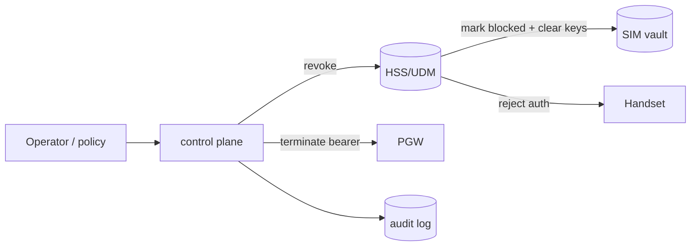

# SIM Revocation, Swap Controls, and Audit

Revocation is how you take credentials away: from a lost card, a leaver, an exposed bundle, or an expired profile. Fairwave treats revocation as an operator action enforced at the HSS/UDM, with the control plane keeping the authoritative ledger.

## CLI

```bash
fairwave sim revoke --imsi 9999912345678901 --reason lost-card
fairwave sim revoke --prefix 9999912 --reason transport-exposure   # whole range
fairwave sim revoke --expired                                        # by profile lifetime
```

Expected output:

```
revoked 1 SIM (9999912345678901)
  reason        lost-card
  effect        HSS auth blocked; active sessions terminated (immediate)
  audit ref     audit/2026-08-02/revoke-000042.json
```

Flags: `--reason` is required (audit), `--immediate` terminates live sessions on the PGW before blocking auth, `--dry-run` lists what would be revoked without doing it.

## Mechanism at the HSS/UDM



Revocation is write-ahead: the HSS subscriber record is marked blocked, the vault flags the credential `revoked`, then (optionally) live bearers are torn down. If the node dies mid-operation, the HSS mark survives — re-running the CLI command is idempotent.

## Blocking lists

- **HSS block list**: per-IMSI; enforced at authentication (auth failure returned to UE).
- **Vault block list**: per credential bundle; prevents re-loading a revoked bundle into any store.
- **Node-level block list**: pushed to the eNB's RRC accept list so a revoked IMSI is refused before it reaches the EPC (belt and suspenders; M5+).

`fairwave sim status --imsi ...` shows which lists the IMSI is on:

```
IMSI 9999912345678901  state: revoked
  hss:   blocked
  vault: revoked
  node:  absent
  reason: lost-card (2026-08-02T10:15:00Z, op: alice@fairwave)
```

## SIM swap controls

SIM swap attacks need to be handled with procedures, not just flags:

- **Cooldown**: issuing a replacement credential for a live IMSI requires a second principal (`sim:admin`) and writes an audit entry; the replacement is not active until the old one is revoked.
- **Proof of possession**: for prod SIMs, the operator should confirm the IMSI's existing bearer before activating a swap.
- **Rate limit**: at most one swap per IMSI per 24 h by policy (configurable in `/v1/policy`).

## Rate limits

The control plane enforces, per operator principal, per hour: 500 issue ops, 200 revoke ops, 50 range revokes. Bursts above limits are logged and rejected with `429` (see [REST reference](../api/rest.md)). These limits exist to catch credential-dumping scenarios (e.g. a compromised operator session) early.

## Audit

Every revocation writes to the audit log:

```json
{
  "ts": "2026-08-02T10:15:00Z",
  "action": "sim.revoke",
  "principal": "alice@fairwave",
  "scope": {"imsi": "9999912345678901"},
  "reason": "lost-card",
  "result": "applied",
  "hash": "9f2c41b07d3a"
}
```

- Audit entries contain hashes, never Ki/OPc or raw IMSI in cleartext at rest (ADR-0010); the IMSI field is redacted in committed logs.
- Retention: audit log retained per policy (default 400 days; see [privacy](../security/privacy.md)).
- Auditors with `sim:auditor` can query revocations by reason, prefix, or date range via `/v1/sims?state=revoked`.

## What revocation cannot do

- It cannot un-attach a handset that never returns to the network — the bearer teardown handles connected devices, and the block list handles the rest.
- It cannot revoke a card already personalized by a bureau if the bundle leaked *before* revocation; that is why transport security and range hygiene matter (see [bureau runbook](bureau-runbook.md)).
- It cannot recover a wiped vault — see [wipe] flows in the [lifecycle](index.md).

## Related

- [Lifecycle overview](index.md) · [Provisioner](provisioner.md) · [Bureau runbook](bureau-runbook.md) · [Operator auth](../security/operator-auth.md)
