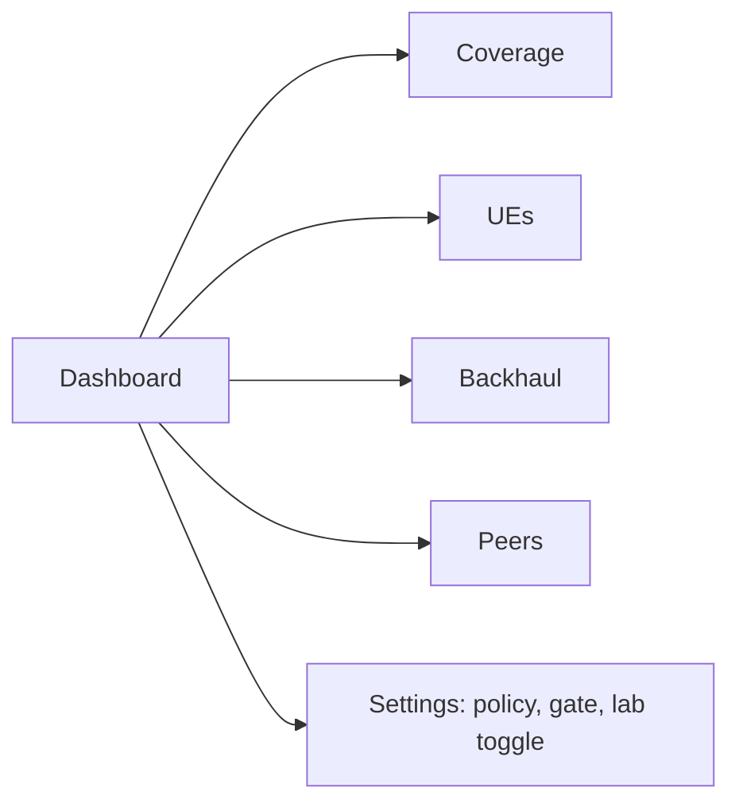

# Operator UI

The operator UI is a **local-first dashboard** served by the box itself. There is no cloud account, no phone-home, no multi-tenant SaaS. It reads only the control-plane REST API v1 and the agent's telemetry.

## Features (v0.1)

| Feature | What it shows |
|---|---|
| Coverage mode | eNB state, band/EARFCN, TX gate state, sync status (GPSDO/NTP) |
| Connected UEs | attach list - **privacy-preserving hashes only**, never raw IMSI; shows PLMN, profile (lab/prod), attach time |
| Backhaul health | uplink throughput, latency, packet loss, PoE/PSU state via agent probes |
| Peering map | mesh graph: peers, mTLS state, WireGuard link state, routes |
| One-click lab mode toggle | flips the stack to zmq lab mode (no RF); refuses to arm TX without the gate |

## Pages

- **Coverage** - the page any operator opens first: is the cell up, is sync good, is the gate armed or (correctly) not.
- **UEs** - table of active attaches. Each row: truncated hash (`fa0c9d…`), profile, band, attach duration, DL/UL counters. No IMSI, no subscriber identity.
- **Backhaul** - last-hour graphs of uplink rate/latency and agent telemetry (CPU temp, SDR temp, GPSDO lock, NTP offset).
- **Peers** - peering map per `docs/architecture/peering.md`.
- **Settings** - policy (APN, breakout), band allow-list, and the lab toggle. TX arming is deliberately *not* a single-click: it walks a confirmation flow (country, license ref, band list) and logs the operator action.

## Auth

- Local accounts only; WebAuthn (passkey/FIDO2) + TOTP (`docs/architecture/security.md`).
- Sessions are local cookies; no third-party identity provider in v0.1.

## Lab Toggle Behavior

- On: compose stack restarted with `zmq` device; `tx/arm` forcibly cleared; UI shows a persistent "LAB MODE - no RF" banner.
- Off: stack restarts with configured RF device; the gate must be re-armed from the CLI or UI confirmation flow; nothing transmits until then.
- The toggle never bypasses the gate; it only changes which device config is rendered.

## Privacy Position

The UI is designed to be screen-shareable: no IMSI, no subscriber content, only hashes and counts. This is enforced at the API (`docs/architecture/telemetry.md`), not merely hidden in the frontend.

## Related

- Telemetry: `docs/architecture/telemetry.md`
- Portal (different audience): `docs/software/captive-portal.md`
- Security: `docs/architecture/security.md`
