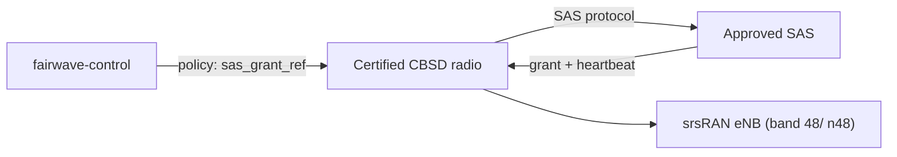

# CBRS (US, FCC Part 96)

> Fairwave defaults to lab/no-RF mode. Transmitting on cellular bands without proper authorization is illegal in most jurisdictions. You are solely responsible for licenses, SAS grants, indoor restrictions, and type approval. HyperonX and contributors provide software as-is for lawful private networks, research, and shared-spectrum regimes only.

CBRS is the one US path where a community network can operate **lawfully and unencumbered** on 3.5 GHz — provided the hardware and software chain is certified and SAS-connected.

## FCC Part 96 Basics

- 3.5 GHz band (3550–3700 MHz) shared with incumbent federal users and Priority Access Licensees (PAL).
- **GAA (General Authorized Access)** — unlicensed-by-individual authorization obtained via SAS; no auction, but must register with a SAS and receive grants.
- **PPA (PAL Protection Area)** — protection arrangements for PAL holders.
- **Certified CBSD** — every Citizens Broadband Radio Service Device must be certified by the FCC and registered with an approved SAS.
- **EIRP caps:** GAA ≤ 30 dBm / 10 MHz nominal (with exceptions); PAL higher. The SAS grant, not the cap, is the binding constraint at runtime.
- **GPS required** — Part 96 mandates location integrity; a GPS/GNSS reference (PPS) is part of the CBSD requirement.

## SAS Providers

The FCC approves SAS instances; among the commercial providers historically: CommScope (Sony is a co-sponsor), Federated Wireless, Google, and others approved at any given time. The current approved list lives with the FCC. Fairwave ships no SAS client of its own in v0.1 — the requirement is to use a **certified SAS client** (either the CBSD vendor's or a third-party approved one).

## Why a Certified SAS Client Is Required

1. A grant from a non-approved SAS is not a grant at all — it is interference.
2. Fairwave's own **mock SAS** (`cbrs/mocksas`) is for development and CI only: it grants instantly, checks nothing, and has no regulatory standing. It must never be used to clear a deployment to transmit.
3. Grants, heartbeats, and shutdown commands come from the real SAS; Fairwave's `tx/arm` policy should require `sas_grant_ref` before arming the `cbrs` profile.

## CBSD Radio Path

A **certified small-cell radio path** is mandatory (Part 96 certification on the device). A generic USB SDR is **not** a CBSD and cannot be gated into CBRS legality by software. See `docs/hardware/bom-tiers.md` for the certified-path BOM.

## Mock SAS Stub

- `mocksas` exists so CI can test gate logic without a network connection.
- It logs everything it "grants" — treat that as an audit artifact, not a licence.
- Deploy gate: `fairwave policy set --profile cbrs --sas-endpoint <approved>`; the mock endpoint should be rejected by policy in a production profile.

## Deploy Checklist (CBRS)

1. Confirm the radio path carries a Part 96 certification (device model registered).
2. Register the CBSD with an approved SAS; obtain SAS client credentials/cert.
3. Install GPS reference; verify PPS lock before startup.
4. Configure `fairwave policy` profile `cbrs`: band 48, EIRP cap per grant class, `sas_endpoint` = approved SAS, `sas_grant_ref` required.
5. Start stack; confirm SAS heartbeat and grant before any TX.
6. Set `tx/arm` with the grant reference; verify agent `safe_tx`.
7. Log grants and heartbeats; keep them (audit/evidence).

## Related

- Regional table: `docs/spectrum-and-law/regional.md`
- BOM: `docs/hardware/bom-tiers.md`
- Checklist: `docs/spectrum-and-law/compliance-checklist.md`
