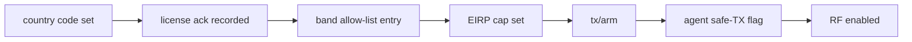

# Spectrum and Law

> Fairwave defaults to lab/no-RF mode. Transmitting on cellular bands without proper authorization is illegal in most jurisdictions. You are solely responsible for licenses, SAS grants, indoor restrictions, and type approval. HyperonX and contributors provide software as-is for lawful private networks, research, and shared-spectrum regimes only.

This section is not legal advice. It describes what Fairwave gates, and what regimes exist, so operators can map their situation to a policy profile. The authoritative matrix lives in `design/spectrum-matrix.md`.

## What the Software Gates

Fairwave refuses to transmit until each gate in this chain is satisfied:

| Gate | Where | Fails closed? |
|---|---|---|
| Country code | `policy` record | yes - unset = no TX |
| License acknowledgment | `policy` record | yes - recorded operator statement |
| Band allow-list | `policy` | yes - EARFCN outside list refused |
| EIRP cap | `policy` per band profile | yes - no cap, no arm |
| `tx/arm` | `POST /v1/tx/arm` | yes - per-boot, re-required |
| Agent `safe_tx` | agent asserts gate + rfkill state | yes - eNB process gated |

Lab mode (`zmq`, no RF) needs none of this; the gate only matters when a real SDR is configured.

## Regime Summary

| Regime | Basis | Fairwave profile |
|---|---|---|
| US CBRS (3.5 GHz) | FCC Part 96, SAS | `cbrs` - certified path required |
| UK Ofcom SAL (shared access) | individual/light-licensed | `community` with local check |
| EU local licenses | national regimes (e.g. DE, FR, NL local/private licenses) | `community` |
| Experimental / campus | research & experimentation licenses | `experimental` |
| India captive | telecom dept captive-network rules | `community` w/ registration |
| Australia ACMA | class/spectrum licences, experimental | `community` |
| Lab / no-RF | none needed | `lab` (default) |

Details per region: `docs/spectrum-and-law/regional.md`.

## The `experimental` Profile

The `experimental`/campus profile is a **reduced-power, confined-site, logged** profile: hard EIRP ceiling, indoor-only flag, site/registration field, mandatory audit logging. It exists so researchers can run lawful experiments without pretending to be a carrier. It does not create authority to transmit - it only encodes whatever authorization the operator already holds.

## Bottom Line

The gates are engineering scaffolding, not permission. If you hold no license, grant, or registration, the only supported configuration is lab mode. When in doubt, run lab mode and read `design/spectrum-matrix.md`.

## Related

- Region specifics: `docs/spectrum-and-law/regional.md`
- CBRS deep dive: `docs/spectrum-and-law/cbrs.md`
- Checklist: `docs/spectrum-and-law/compliance-checklist.md`
