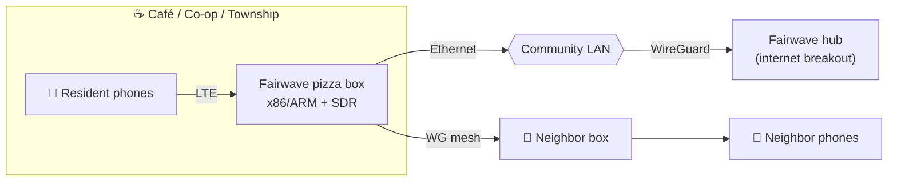

# Vision: the air is for everyone

!!! info "Legal banner"
    **Fairwave defaults to lab/no-RF mode.** Transmitting on cellular bands without proper
    authorization is illegal in most jurisdictions. You are solely responsible for licenses,
    SAS grants, indoor restrictions, and type approval. HyperonX and contributors provide
    software as-is for lawful private networks, research, and shared-spectrum regimes only.

## The broken system

Mobile connectivity is sold as a utility but governed like a toll bridge. Three properties
of the modern mobile market create the harm:

1. **Coverage is where the revenue is, not where people are.** Rational MNOs abandon low-ARPU
   areas. Villages, basement flats, boat marinas, festival sites, disaster scenes: red ink.
2. **The SIM is a leash.** Your phone's identity is issued by someone else, revocable by
   someone else, and priced by someone else. Switching costs are engineered, not natural.
3. **The infrastructure is unownable.** The only box that can legally talk to your handset
   on licensed-by-default bands is one *they* operate. You can buy a Wi-Fi router; you cannot
   buy the equivalent for cellular without a lawyer and a warehouse.

Every year the gap widens: handsets get better, modems get cheaper, software radios get
stronger — yet the baseline experience of "no bars" stays exactly where it was in 2009 for
hundreds of millions of people.

## The HyperonX fix

**Fairwave is the community carrier: a complete, open-source small-cell in a pizza box.**

- **Own the last mile yourself.** One box, ordinary Ethernet, local PLMN. Your SIM, your
  HSS/UDM, your data path. Traffic for the café printer never leaves the building.
- **Peer instead of plead.** Boxes discover each other, mutually authenticate over mTLS,
  tunnel with WireGuard, and share reachability. Two boxes are already better than one.
- **Break out where it makes sense.** An upstream Fairwave hub (or your ISP) carries
  off-island traffic. Wi-Fi calling / ePDG hooks bridge you back to the national core with
  *your* consent, not by default.
- **Stay lawful by construction.** Spectrum arming requires a country code, a license /
  indoor-private / lab-attenuator acknowledgment, and a per-profile frequency allow-list.
  If you can't satisfy the gate, the software stays in zero-IF loopback and won't compile
  otherwise.

## What you get, concretely

| | |
|---|---|
| 🧠 Control plane | Go: identity, enrollment, reconcile loop, REST+gRPC, Prometheus/OTLP |
| 📡 RAN | srsRAN Project eNB/gNB; RF (USRP/LimeSDR/BladeRF) or zmq loopback |
| 🏛️ Core | Open5GS EPC (4G-first); 5G SA/NSA stubs behind flags |
| 💳 SIM | Offline provisioner, Ki/OPc generation (or HSM import), bureau CSV/JSON |
| 🕸️ Peering | mDNS rendezvous → mTLS control → WireGuard data plane, route exchange |
| 👁️ Portal | Local-first operator UI, captive portal for onboarding/Wi-Fi-calling path |
| 🧪 Lab | Docker Compose: core + zmq eNB + srsUE; attach asserted in CI |

## Why it threatens incumbents

MNO value concentrates in scarcity: scarce spectrum, scarce towers, scarce SIMs. Fairwave
makes the *local* copy abundant. It doesn't need to beat the national network everywhere —
it only needs to beat it in the café, the co-op, the village. Once offload and roaming
interfaces normalize, the national SIM becomes the *overlay*, not the *access*. That's an
existential re-pricing of the least defensible part of the wireless cartel.

## Why it's feasible now

- Open implementations (Open5GS, srsRAN, Magma lineage, OAI) crossed the maturity threshold.
- SDRs cover small-cell power levels at hardware-store prices.
- Regulators opened local/shared regimes: CBRS SAS, UK shared access, EU local licenses.
- Wi-Fi calling trained handsets to prefer a local anchor when the operator consents.
- Compute is cheap; a NUC can run EPC + eNB + control plane simultaneously.

## The promise & the boundary

Fairwave's promise: **if you can run a router, you can run a cell**.
Its boundary: we ship no code path that hides identifiers from lawful intercept where
required, jams, spoofs PLMNs, or transmits outside authorized frequencies. Community
infrastructure deserves the same legitimacy as any carrier — and only gets it by behaving
like one. See the [threat model](design/threat-model.md) and
[spectrum matrix](design/spectrum-matrix.md).

## Why "Fairwave-Sim"?

Because the SIM is where freedom actually lives: the moment a community can issue, revoke,
and roam its own credentials, the private cell becomes a *carrier*, not a toy. This repo
is the reference implementation of that idea.
